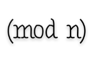

# mod [](https://travis-ci.org/yoeo/mod) [](http://mod.readthedocs.io/en/latest/?badge=latest)

`Modular arithmetic` in Python.



[Modular arithmetic](https://en.wikipedia.org/wiki/Modular_arithmetic)
is arithmetic for integers, where numbers wrap around
when reaching a given value called `modulus`.
For example `6 ≡ 1 (mod 5)`.

Modular arithmetic has several practical applications including:
[music](https://en.wikipedia.org/wiki/Octave),
[banking](https://en.wikipedia.org/wiki/International_Bank_Account_Number#Check_digits),
[book publishing](https://en.wikipedia.org/wiki/International_Standard_Book_Number#Check_digits),
[cryptography](https://en.wikipedia.org/wiki/RSA_%28cryptosystem%29)...
and of course math.

The purpose of this package is to simplify
the use of modular arithmetic in **Python3**.

## Usage

This package provides `Mod` integers
that compute arithmetic operations like `+ - * // **` with a modulus:

```python
from mod import Mod

# Funny math here

x = Mod(5, 7)      # x ≡ 5 (mod 7)

(x + 2) == 0       # True: 5 + 2 ≡ 7 ≡ 0 (mod 7)
(x + 7) == x       # True: 5 + 7 ≡ 12 ≡ 5 (mod 7)
(x**3) == (x + 1)  # True: 5³ ≡ 125 ≡ 6 (mod 7)
(1 // x) == 3      # True: 5 × 3 ≡ 15 ≡ 1 (mod 7) ⇒ 5⁻¹ ≡ 3 (mod 7)
```

A naive implementation of
[RSA encryption algorithm](https://en.wikipedia.org/wiki/RSA_%28cryptosystem%29#Encryption)
using `mod` package:

```python
from mod import Mod


# My RSA keys
public_key = Mod(3, 61423)
private_key = Mod(40619, 61423)

# My very secret message
top_secret_message = 666

# RSA encryption
encrypted = top_secret_message**public_key

# RSA decryption
decrypted = encrypted**private_key

# My secret message have been correctly encrypted and decrypted :-)
assert decrypted == top_secret_message
```

Note that:

* `Mod` is based on integer modulo operation `%`, not `math.fmod`
* the result of an operation between a `Mod` and an `int` is a `Mod`
* the result of an operation between a `Mod` and a `float` is a `float`

## Install

Run the following command to install `mod` package

```bash
pip3 install mod
```

## Links

* Package documentation located at http://mod.readthedocs.io/en/latest/
* Python package available at https://pypi.python.org/pypi/mod
* Source code repository: https://github.com/yoeo/mod

# License

mod — Copyright (c) 2017 Y. SOMDA, [MIT License](LICENSE)
